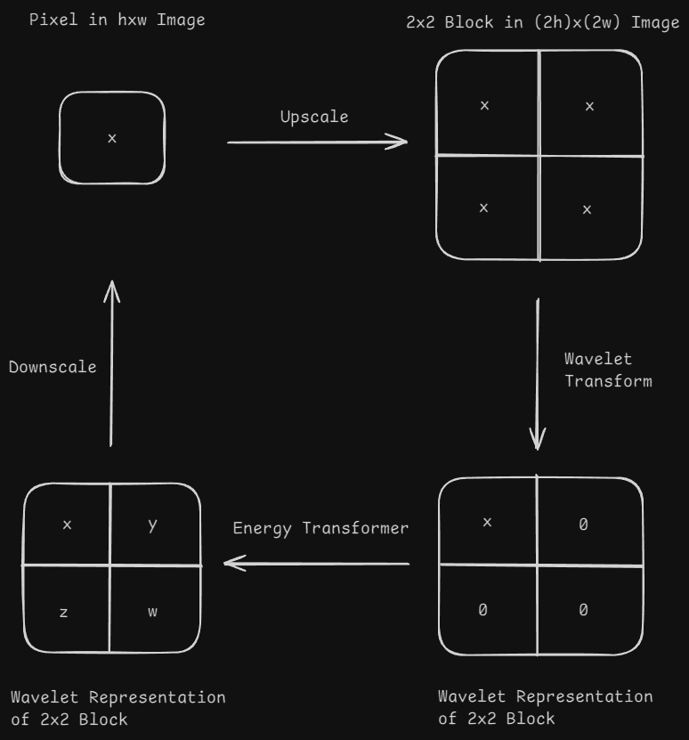

# Energy Transformer for Image Super-Resolution
This repository contains an implementation of the Energy Transformer architecture for image super-resolution. The Energy Transformer was introduced in: ["Energy-Transformer"](https://arxiv.org/pdf/2302.07253).

This implementation is based on the implementation provided in the [official repository](https://github.com/Lemon-cmd/energy-transformer-torch/tree/main).

# Wavelets for Image Super-Resolution

